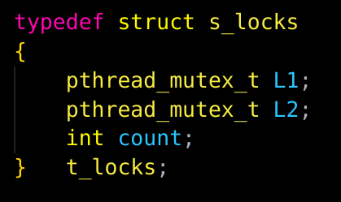

### Time to think deeper, and contemplate the secrets of sharing memory, and synchronize the access to the data.

Imagine a scenario where you wanted to contemplate and find new philosophical ideas, but u wanted some inspiration, so you invited five of the most brilliant philosophers of your time,
you arranged a beautiful round table and provided a plate containing the most tasteful and delicious spaghetti for them, yet you faced an issue, for some reason, each philosopher wants to use two forks to eat from the spaghetti, remember its delicious they want to eat the maximum, and since you have only five forks at home, each for philosopher, you need now to order and synchronize the eating, so when one of them try to eat, he will grab his fork and the fork of his fellow philosopher, without letting any one of them die from starvation, you need to find a way where all of them can eat, and think of course, because that's the main reason you invited them for, and a time for them to sleep, respect you guests they need to have some rest.

Philosophers and table image link : [Philosophers image](https://austingwalters.com/multithreading-dining-philosophers-problem/)
Universe and space image from: Mattia Verga, from pixabay, link : [Universe && Space image](https://pixabay.com/photos/space-astronomy-galaxy-universe-9250868/)

### ***MANDATORY***
**New Concepts** :
The new concepts we are going to learn in this project are:

> Thread.
> Mutexes.
> Race Condition. (Data Race)
> Deadlock.

##### ***Threads*** :
Thread is a logical sequence of instructions inside a process, it is automatically managed by the operating system's kernel, think of it as a big company (process), and each section of the company is doing a job (thread), yet they are all joined inside of the company.
A process could have multiple threads, each thread has its own ID, its own stack, its own instruction pointer, and its own processor register, yet they share the same virtual memory address space (same code, same heap, same shared libraries and same open file descriptors).

 `Thread private stack:`
	 each thread has it own private stack, located in different region than the shared virtual memory, when you declare a variable for example inside of a thread, its address is stored inside of that thread private stack.
 `Sharing Virtual Memory:`
	 a process has a virtual memory address space, all threads within that process share this same virtual memory, this includes the code, the heap, and the shared libraries.
	 the kernel arrange this virtual memory in some way that all the threads have access to it.

**So whats the difference between a thread and a process ?**

`Process`
Basically a process, is like a program running, it has its own memory space, (code, data, heap), it is independent from other processes, has its own address space and resources (file descriptors, memory), uses IPC (**Inter-Process Communication**) to communicate to with other processes, which is typically slower because they don't share the same memory.

`Thread`
A thread is a smaller unit of execution within the `Process`, a single process could hold multiple threads, and they share the same memory space provided by it, as we said each thread has its own private stack, yet they can easily communicate with each others by accessing the shared memory, much faster communication than processes.
Example: In a web browser, one thread might be handling the user input, while another thread handles rendering the page, independent roles, yet they can easily communicate with each others since they share the same memory.

***Simple Analogy:*** (by Chatgpt)

- Think of a **process** as a **house**. The house has its own **furniture**, **rooms**, and **resources** (its own space).
    
- A **thread** is like a **person** inside the house. Multiple people (threads) can live in the same house (process), using the same furniture (memory), but each person (thread) has their own private **room** (stack) where they keep their things (local variables).

##### ***Mutexes && Data Race*** :
Let's say we have two threads, and both threads are meant to change the value of a variable, in the following order, thread 1 sets the data "A" into the variable then the thread 2 sets the data "B" into the same variable, so the predictable data that will remain in the variable at the end is "B", yet we will find in some case that is "A", that's what's called  **Data Race** (Race Condition), we can't predict the order in which the threads are going to operate, which one the kernel will prioritize, so here we have no synchronization, and one philosopher could take a fork of another one while he is eating, if you want no fighting in your house, you must use **Mutexes**.

**Mutex** (short term for "mutual exclusion), is essentially a lock that allows us to regulate access to data and prevent shared resources being used at the same time.
Think of it, as a bathroom door lock sign, you put it on the door lock to indicate that the bathroom is full, (a thread is using the toilet), so the other thread will not enter the bathroom and modify the content.

***for example in our situation we can use the Mutex to lock the eating phase for one philosopher at the time (one thread at the time), and after that philosopher done eating that phase is going to get unlocked for the next philosopher to eat, the Mutex lock function does not lock the variable itself, (the fork), but what it does, is locking the event happening (the eating), from being invaded by other hungry philosopher.***
And from here, we will face a new danger that might happens, ***Deadlocks***.

##### ***Deadlocks*** :
lets say the we have two threads again (thread 1 and thread 2), and we have a struct containing two Mutex variables L1 and L2, and count.
the first thread need to lock L1 then L2, then increment count += 1,
in the same time, the second thread, will lock L2 first them L1, and then increment count += 1.

so as we said, the Mutex helps us regulate access timing of each thread to the targeted data, when we lock that section of code, the next thread will have to wait the first thread to unlock that section so it can access and do its job.

in the situation we posed, the locking differs from thread 1 to thread 2, so what will happen is this:

	`thread1 -> locks L1 -> attempts to lock L2`
	`thread2 -> locks L2 -> attempts to lock L1`

thread 1 will wait for thread 2 to unlock L2, and thread 2 will wait for thread 1 to unlock L1, and they will wait forever, in our case, you invited philosophers to dinner to grasp new philosophical concepts, and here you are with a murder charge, so beware of **Deadlocks**.

*****
